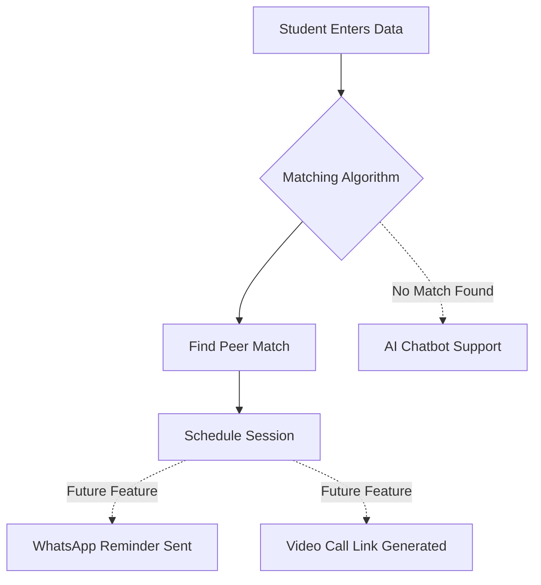

# Sahay – Peer Learning Matchmaking System 🎓🤝

**Sahay** is an adaptive peer-learning platform designed to bridge educational gaps for NGO and college students by intelligently pairing learners based on subject strengths, weaknesses, academic year, and availability.

---

## 🚩 Problem Statement
NGO students face multiple challenges that hinder effective learning:

- **High Student–Teacher Ratio:** Many NGOs operate with ratios as high as 1:40, making personalized attention difficult.
- **Limited Resources:** Students come from diverse academic backgrounds; traditional one-size-fits-all teaching often leaves many behind.
- **Low Digital Literacy:** Nearly **60–80% of rural students** struggle with digital learning tools, widening learning gaps.

These challenges result in uneven learning outcomes and reduced student confidence.

---

## 💡 Our Solution
**Sahay** enables structured and supportive **peer-to-peer learning** by leveraging student strengths within the same learning community.

### Key Solution Highlights
- **Skill-Based Matching:** Students specify subjects they are strong in and where they need help.
- **Rubric-Based Algorithm:** A compatibility score identifies the best mentor–mentee pairs.
- **Adaptive Motivation:** Mentors earn **credits, badges, and recognition** after successful sessions.
- **Support Escalation:** AI assistance and faculty support are available when peers cannot resolve doubts.

---

## ⚙️ How It Works (Solution Flow)



## 📺 Project Demonstration
Watch our 48 sec pitch and demo here:
[▶️ Watch Sahay Demo Video](https://youtu.be/73Fth5d9dmw?si=fcmcV56LIbtmEVvh)


## 📸 App Screenshots

### 🎯 1. Smart Match Found
Our algorithm intelligently pairs a Mentor with a Mentee based on complementary subject strengths and compatibility scores.


### 💬 2. Interactive Learning Session
The session interface features a prototype chat, resource sharing, and future-ready "Ask AI" and "Video Call" integrations.


### 🏆 3. Leaderboard & Gamification
To keep students motivated, we use a reward system where mentors earn points, badges, and rank on a real-time leaderboard.


## 🎮 Core Features
- Role-based onboarding (**Student / Teacher**)
- Academic year classification (FY, SY, TY, Fourth Year)
- Strength–weakness-based mentor–mentee matching
- Gamified matchmaking experience
- Learning session interface:
  - Chat (prototype)
  - File sharing (PDFs, images, links)
  - AI helper (prototype)
- Faculty escalation option
- Mentor rating, credits, and badge system
- Session-based mentor leaderboard

---

## 🛠️ Tech Stack
- **Python**
- **Streamlit**
- **GitHub** (Version Control)
- **Streamlit Community Cloud** (Deployment)

---

## 💻 How to Run Locally

Follow these steps to set up the **Sahay** prototype on your computer:

1. **Clone the repository:**

```bash
git clone https://github.com/GitBeat16/adaptive_learning_ngo.git
```

2. **Install dependencies:**

```bash
pip install streamlit
```

3. **Run the application:**

```bash
streamlit run app.py
```

4. **Access the App:** Open your browser and go to `http://localhost:8501`.

# 🌐 Live Demo

🔗 Streamlit Community Cloud Deployment
https://adaptivelearningngo-ctc-thesemicolon.streamlit.app/

## 🔮 Future Scope

* Real-time chat and video calling (WebRTC integration)
* AI-powered doubt resolution
* Persistent database integration
* Mentor analytics and performance tracking
* WhatsApp/SMS reminders for learning sessions
* Support for vocational and skill-based learning

## 👥 Team Details

* Team Name: The Semicolon
* Project Name: Sahay – Peer Learning Matching System

👩‍💻 Team Leader
* Srushti Kalokhe

👩‍💻 Team Members
* Srushti Kalokhe
* Swarali Warade
* Nikita Sharma
* Tanieeshka Sonawane
* Anushka Dhane

## 🏆 Hackathon Note
This project is a functional prototype developed during a hackathon.
The focus is on demonstrating logic, user flow, and scalability, with advanced features planned for future development.


